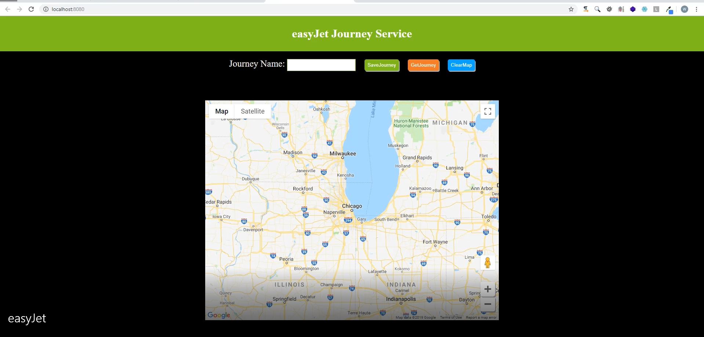

# Simple Airplane Journey Management System

[This example shows simple ways to import and export journey information using Google Maps API](https://drive.google.com/file/d/1htR_6YuLOQLLl9FLSu7kkJqs5VSNe5WW/view?usp=sharing)  

## 系统截图（System Screenshot)

This system uses Python's Bottle Framework.